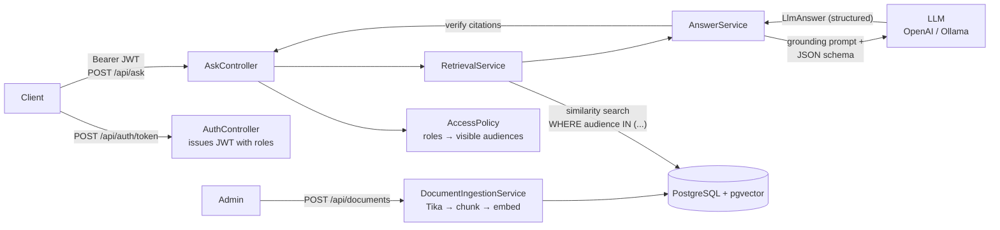

# PolicyDocs RAG: Secure RAG Policy Engine

[](https://github.com/argod2213/secure-rag-policy-engine/actions/workflows/ci.yml)

A retrieval-augmented generation (RAG) API that answers questions about company policy documents.
Answers come **only from cited sources**, and users can **only retrieve documents their role allows**.

**Stack:** Java 21 · Spring Boot 3.5 · Spring AI 1.1 · PostgreSQL + pgvector · Spring Security (JWT) · Flyway · Testcontainers · Docker · AWS (ECS Fargate, RDS, ALB, Secrets Manager) · Terraform

---

## What it does

| Capability | How it is implemented |
|---|---|
| **Document ingestion** | Upload PDF / DOCX / HTML / Markdown / text. Apache Tika extracts the text, which is normalized and split into ~350-token chunks with Spring AI's `TokenTextSplitter`, embedded, and stored in pgvector. A content SHA-256 hash stops the same document from being ingested twice. |
| **Semantic retrieval** | Cosine similarity search over an HNSW index in PostgreSQL/pgvector, with a configurable `topK` and similarity threshold. |
| **Answers grounded in cited sources** | Retrieved chunks are labelled `S1..Sn` and sent to the model with strict grounding rules. The model must cite source ids, and the server **verifies** every citation against the retrieved set. Hallucinated ids are dropped, and an answer with no valid citation is downgraded to "not found". |
| **JWT auth + role-based filtering** | Stateless HS256 JWTs carry a `roles` claim. Each role unlocks a document audience (`PUBLIC`, `EMPLOYEE`, `HR`, `FINANCE`, `LEGAL`). The audience filter is **pushed down into the pgvector query**, so restricted chunks never leave the database or reach the LLM. Results are re-checked afterwards as defense in depth (fail closed). |
| **Structured outputs** | The model returns a typed `LlmAnswer` record (`answer`, `citedSourceIds`, `answerable`, `confidence`) through Spring AI's `BeanOutputConverter`/JSON schema. The API returns a typed `AnswerResponse` with citations and snippets. |
| **Evaluation set** | `eval/eval-set.json` holds 16 labelled cases, including access-control cases ("an employee asks about HR salary bands") and out-of-scope questions. The evaluator reports retrieval hit rate, citation accuracy, keyword coverage, abstention accuracy and **access violations (must be 0)**. |

## Architecture



Request flow for `POST /api/ask`:
1. Spring Security validates the JWT, and the `roles` claim becomes authorities.
2. `AccessPolicy` turns the roles into visible audiences: everyone gets `PUBLIC`, each role unlocks its own audience, and `ADMIN` sees everything.
3. `RetrievalService` runs a vector search with the filter `audience IN [...]`.
4. If nothing relevant is visible, the API **abstains without calling the model**. This saves cost and gives the model nothing restricted to leak.
5. Otherwise `ChatClient` is called with the numbered sources and returns a structured `LlmAnswer`.
6. Citations are verified and enriched with title, chunk index, score and snippet.

## Quick start

There are three ways to run it:

| Where | Cost | Guide |
|---|---|---|
| Your computer (Docker) | free with Ollama, cents with OpenAI | below |
| GitHub Codespaces (browser, nothing to install) | free monthly hours | below |
| Public URL: Render + Neon | free tiers + OpenAI usage | [docs/deploy-render-neon.md](docs/deploy-render-neon.md) |

### Option A: Docker Compose with OpenAI
```bash
cp .env.example .env            # put your OPENAI_API_KEY in .env
docker compose up --build
```

### Option B: fully local with Ollama (free, no API key)
```bash
cp .env.example .env
# in .env set: AI_PROVIDER=ollama, EMBEDDING_DIMENSIONS=768, OLLAMA_CHAT_MODEL=llama3.2:3b
docker compose --profile ollama up --build
```
The app waits for Ollama to be healthy, then pulls the chat and embedding models on first start.
That takes a few minutes. `llama3.2:3b` fits a laptop with about 8 GB of RAM; the default `llama3.1:8b` needs more.

### Option C: GitHub Codespaces
On GitHub click **Code → Codespaces → Create codespace**. The dev container includes Java 21, Maven
and Docker. In the terminal run Option A or B, then open the forwarded port 8080.

### Option D: run from source
```bash
docker compose up -d db
export OPENAI_API_KEY=sk-...
mvn spring-boot:run
```

On first start, nine sample policies for the fictional company *Northwind Labs* are ingested
(see `src/main/resources/seed`). Swagger UI is served at <http://localhost:8080/swagger-ui.html>.

## Try it

Demo users (password `password` locally, or `DEMO_PASSWORD`; `admin` uses `ADMIN_PASSWORD` if set):

| User | Roles | Can see |
|---|---|---|
| `alice` | EMPLOYEE | PUBLIC, EMPLOYEE |
| `hana` | EMPLOYEE, HR | + HR |
| `felix` | EMPLOYEE, FINANCE | + FINANCE |
| `admin` | ADMIN | everything; can ingest, delete and run evals |

```bash
TOKEN=$(curl -s -X POST localhost:8080/api/auth/token -H 'Content-Type: application/json' \
  -d '{"username":"alice","password":"password"}' | jq -r .accessToken)

curl -s -X POST localhost:8080/api/ask -H "Authorization: Bearer $TOKEN" \
  -H 'Content-Type: application/json' \
  -d '{"question":"How many days per week can I work remotely?"}' | jq
```

```json
{
  "question": "How many days per week can I work remotely?",
  "answer": "Full-time employees who have completed probation may work remotely up to 3 days per week [S1].",
  "grounded": true,
  "confidence": "HIGH",
  "citations": [
    {
      "sourceId": "S1",
      "documentId": "6f0c...",
      "title": "Remote Work Policy",
      "chunkIndex": 0,
      "score": 0.71,
      "snippet": "# Remote Work Policy ## Eligibility and schedule All full-time employees ..."
    }
  ],
  "retrievedChunks": 5
}
```
*(Example shape. The exact wording depends on the model.)*

Now ask `"What is the salary band for an L3 Senior Engineer?"` as `alice`: you get
`grounded: false` and no HR content. Ask as `hana` and you get the cited answer.

### API

| Method | Path | Role | Description |
|---|---|---|---|
| POST | `/api/auth/token` | public | Exchange username/password for a JWT |
| POST | `/api/ask` | any | Ask a question → grounded, cited, structured answer |
| GET | `/api/documents` | any | List documents visible to the caller |
| POST | `/api/documents` (multipart) | ADMIN | Upload a file with `title` and `audience` |
| POST | `/api/documents/text` | ADMIN | Ingest raw text/Markdown as JSON |
| DELETE | `/api/documents/{id}` | ADMIN | Delete a document and all of its chunks |
| POST | `/api/eval/run` | ADMIN | Run the evaluation set against the live models |
| GET | `/actuator/health` | public | Liveness/readiness |

## Evaluation

Run `POST /api/eval/run` as `admin` to score the live system. The report contains:

| Metric | Meaning |
|---|---|
| `retrievalHitRate` | Share of answerable cases where the expected document was retrieved |
| `citationAccuracy` | Share of answerable cases where the expected document was cited |
| `keywordCoverage` | Average share of expected facts (e.g. `"$500"`, `"16 weeks"`) present in the answer |
| `abstentionAccuracy` | Answered when it should, said "not found" when it should (including access-denied cases) |
| `accessViolations` | Retrieved chunks outside the caller's audiences. **Must be 0.** |
| `results[]` | Per-case detail: roles, hits, grounded flag and the answer text |

Real numbers depend on the model and embedding provider you configure, so run it against your own setup.

The pass criteria are configurable: `accessViolations == 0`, `retrievalHitRate >= 0.8` and `abstentionAccuracy >= 0.8`.

## Testing

```bash
mvn verify
```

- **Unit tests:** access-policy rules and filter construction, citation verification, prompt construction, seed parsing.
- **Integration tests** (`PolicyRagIT`): a real PostgreSQL + pgvector instance started with **Testcontainers**, the real JWT flow,
  the real Spring AI `PgVectorStore` and `ChatClient` structured-output parsing. They cover:
  - bad credentials and missing or invalid tokens are rejected
  - document listing is filtered by role
  - **every eval question × five role sets never retrieves a chunk outside the caller's audiences**
  - an employee cannot learn HR-only facts, while an HR user gets a cited answer
  - only ADMIN can ingest; duplicates return 409; deleting a document removes its chunks
  - the model is not called when nothing relevant is visible
  - the full evaluation set passes with zero access violations

To keep CI fast, free and deterministic, the tests replace the LLM and embedding model with offline
test doubles (a hashed bag-of-words embedder and an extractive answerer that still returns structured JSON).
Everything else, including the database, vector search, security and output parsing, is the production code path.

## Project layout

```
src/main/java/io/github/argod2213/policyrag
├── access/      Audience enum + AccessPolicy (roles → audiences → pgvector filter)
├── security/    JWT encoder/decoder, SecurityFilterChain, token endpoint
├── document/    Ingestion pipeline (Tika, chunking, embedding), catalogue repository, seeding
├── rag/         Retrieval, prompt construction, structured LLM answer, citation verification
├── eval/        Evaluation set runner and metrics
├── config/      Typed @ConfigurationProperties
└── web/         RFC 9457 problem-details error handling
src/main/resources
├── db/migration Flyway migrations
├── seed/        Sample policy documents (fictional company)
└── eval/        Labelled evaluation set
infra/aws/       Terraform for AWS (VPC, ALB, ECS Fargate, RDS, Secrets Manager, ECR, OIDC)
```

## Deploying

- **Free public demo:** Render + Neon. See [`docs/deploy-render-neon.md`](docs/deploy-render-neon.md) and `render.yaml`.
- **AWS:** see below.

### AWS (Terraform)

[`infra/aws`](infra/aws) provisions the full stack as code: VPC, an Application Load Balancer, ECS Fargate, RDS PostgreSQL with pgvector,
Secrets Manager, ECR, CloudWatch, and a GitHub OIDC role. The **Deploy to AWS** GitHub Actions workflow builds the image, pushes it to ECR
and rolls the ECS service, with no long-lived AWS keys stored in GitHub. See [`infra/aws/README.md`](infra/aws/README.md) for the diagram, cost notes and steps.

## Configuration

| Env var | Default | Purpose |
|---|---|---|
| `AI_PROVIDER` | `openai` | `openai` or `ollama` |
| `OPENAI_API_KEY` | – | Required when using OpenAI (or an OpenAI-compatible API) |
| `OPENAI_BASE_URL` | `https://api.openai.com` | e.g. `https://openrouter.ai/api` for OpenRouter |
| `OPENAI_CHAT_MODEL` / `OPENAI_EMBEDDING_MODEL` | `gpt-4o-mini` / `text-embedding-3-small` | With OpenRouter: `openai/gpt-4o-mini` / `openai/text-embedding-3-small` |
| `EMBEDDING_DIMENSIONS` | `1536` | Must match the embedding model (`768` for `nomic-embed-text`) |
| `DB_URL` / `DB_USERNAME` / `DB_PASSWORD` | local compose values | PostgreSQL connection |
| `DEMO_PASSWORD` / `ADMIN_PASSWORD` | `password` | Demo user passwords; set a private `ADMIN_PASSWORD` on any public deployment |
| `PORT` | `8080` | HTTP port (set automatically by Render and similar hosts) |
| `JWT_SECRET` | dev-only value | HS256 signing key, at least 32 chars. **Always override.** |
| `RAG_SIMILARITY_THRESHOLD` | `0.3` | Minimum cosine similarity for retrieved chunks |
| `SEED_ENABLED` | `true` | Load the sample documents on first start |

## Security notes and limitations

- The demo users are for local development. In production, point the resource server at a real identity provider; the role-to-audience mapping stays the same.
- Prompt-injection mitigation: source text is wrapped in delimiters and the system prompt tells the model to treat it as data. The more important protection is architectural: the model only ever sees documents the caller is already allowed to read.
- Each document has a single audience. Finer-grained ACLs (per-user or per-group) would extend `AccessPolicy` and the chunk metadata.

## License

MIT
